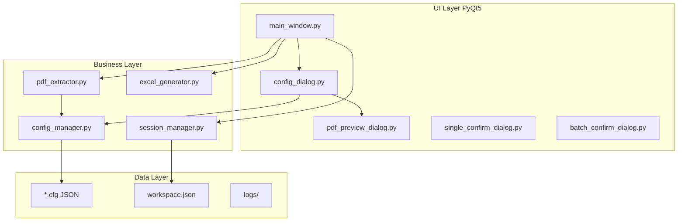

# PDF信息提取工具 — 从 0 到 1 开发计划

## 现状与目标

- **现状**：工作区仅有 [PRDs/](d:\AppData\workspace\PRDs) 三份文档，无源码。
- **目标**：交付单 exe + `default.cfg` + README + 完整源码，功能覆盖三份 PRD 的交集，并纳入你确认的 **v1 会话持久化**（关闭后恢复文件列表、已确认数据、处理进度）。
- **环境策略**：Win10/11 日常开发；依赖版本锁定 Win7 兼容；打包后在 Win7 做兼容性验收。

## 文档职责（防止失忆速查表）

| 遇到问题时查 | 文档 | 典型章节 |
|---|---|---|
| 功能做什么、流程怎么走 | [PRD.md](d:\AppData\workspace\PRDs\PRD.md) | §3 功能需求、§3.2 核心处理逻辑、§5 交互流程 |
| 用什么库、怎么分包、接口签名 | [development.md](d:\AppData\workspace\PRDs\development.md) | §3 技术选型、§4 模块设计、§5 实现规范 |
| 颜色字体、控件样式、线框图 | [UI.md](d:\AppData\workspace\PRDs\UI.md) | §2 视觉规范、§3 组件规范、§4 页面设计 |
| 线框图（ASCII 版） | [PRD.md](d:\AppData\workspace\PRDs\PRD.md) | §4 界面设计 |

**文档冲突处理（已对齐）**：
- 会话持久化：以 [UI.md §4.3 可靠性](d:\AppData\workspace\PRDs\UI.md) 为准，v1 实现。
- 内存上限：开发期以 [PRD.md §6.1](d:\AppData\workspace\PRDs\PRD.md) 500MB 为验收参考；[UI.md](d:\AppData\workspace\PRDs\UI.md) 200MB 作为优化目标。
- README 交付：同时提供 `README.txt`（PRD 交付要求）与 `README.md`（开发文档要求），内容一致。

## 目标架构



**v1 新增模块**：`session_manager.py`（PRD 未列但 UI 要求；接口保持简单，不改动其他模块公开 API）。

## 阶段 0 — 项目脚手架与环境

**产出**：`pdf_extractor/` 目录、依赖清单、日志基础设施、`default.cfg` 骨架。

**任务**：
1. 按 [development.md §6.3](d:\AppData\workspace\PRDs\development.md) 创建目录结构（新增 `session_manager.py` 占位）。
2. 创建 `requirements.txt`，锁定版本：
   - Python 3.8.10 / PyQt5==5.15.2 / pdfplumber==0.9.0 / PyMuPDF==1.20.2 / openpyxl==3.0.10 / pyinstaller==4.10
3. 在 `main.py` 初始化：应用目录解析（兼容 PyInstaller `--onefile`）、`logs/` 自动创建、按 [PRD.md §3.5.1](d:\AppData\workspace\PRDs\PRD.md) 配置 `logging`（按日轮转、保留 30 天）。

**检查点 — 重读文档**：
- [development.md §3 技术选型](d:\AppData\workspace\PRDs\development.md)：确认版本号不可替换。
- [development.md §7.3 部署](d:\AppData\workspace\PRDs\development.md)：`default.cfg` 与 exe 同目录、`logs/` 自动创建。

---

## 阶段 1 — 配置管理器 `config_manager.py`

**产出**：JSON 配置读写 + 默认模板（编号/名称/日期/金额四字段）。

**任务**：
1. 实现 [development.md §4.2.3](d:\AppData\workspace\PRDs\development.md) 三个静态方法：`save` / `load` / `get_default`。
2. 定义配置 schema（建议结构）：
   ```json
   {
     "rule_name": "默认规则",
     "regions": [
       {"name": "编号", "page_range": "第1页", "x1": 0, "y1": 0, "x2": 0, "y2": 0, "data_type": "文本"}
     ]
   }
   ```
3. 编写 [`default.cfg`](d:\AppData\workspace\pdf_extractor\default.cfg)（UTF-8 JSON，扩展名 `.cfg` 符合 PRD）。
4. 损坏/缺失时 fallback 到 `get_default()`（[development.md §5.5](d:\AppData\workspace\PRDs\development.md)）。

**检查点 — 重读文档**：
- [PRD.md §3.3.1](d:\AppData\workspace\PRDs\PRD.md)：区域字段清单（名称、页面范围、坐标、类型）。
- [PRD.md §3.1.4](d:\AppData\workspace\PRDs\PRD.md)：加载/保存 `.cfg` 入口行为。

---

## 阶段 2 — PDF 提取器 `pdf_extractor.py`

**产出**：按坐标从 PDF 提取结构化字段，含清洗与校验。

**任务**：
1. 实现 [development.md §4.2.1](d:\AppData\workspace\PRDs\development.md) `PdfExtractor` 接口。
2. 用 **pdfplumber** 按 bbox 提取文本；页面范围解析（`第N页` / `第N-M页` / `所有页`）。
3. 坐标系：PDF 原生坐标，原点在左下角（[development.md §5.1](d:\AppData\workspace\PRDs\development.md)）。
4. 后处理（[PRD.md §3.5.2](d:\AppData\workspace\PRDs\PRD.md)）：去多余空格/换行/特殊字符；数字/日期格式校验；单文件失败返回错误状态不抛到上层。
5. `extract_batch`：逐文件独立 try-except，失败项带 `status: failed` + `error_msg`。

**检查点 — 重读文档**：
- [PRD.md §3.2](d:\AppData\workspace\PRDs\PRD.md)：单文件 vs 多文件处理分支（提取层只负责数据，不负责弹窗）。
- [PRD.md §6.1](d:\AppData\workspace\PRDs\PRD.md)：单 PDF ≤2s 性能目标（避免全文件多次打开，复用 pdfplumber 句柄）。

---

## 阶段 3 — Excel 生成器 `excel_generator.py`

**产出**：按「编号」升序生成带样式的 `.xlsx`。

**任务**：
1. 实现 [development.md §4.2.2](d:\AppData\workspace\PRDs\development.md) `ExcelGenerator` 接口。
2. 功能对齐 [PRD.md §3.1.5 / §3.4](d:\AppData\workspace\PRDs\PRD.md)：
   - 列含动态提取字段 + 「来源文件」
   - 表头加粗 + 背景色（色值见 [UI.md §2.1 表头 #E5F3FF](d:\AppData\workspace\PRDs\UI.md)）
   - 自动列宽
   - 默认文件名 `PDF信息汇总表_YYYYMMDD_HHMMSS.xlsx`
3. 异常：目标文件被占用、磁盘不足 → 返回 `False` + 日志，由 UI 弹 `QMessageBox`（[PRD.md §3.5.2](d:\AppData\workspace\PRDs\PRD.md)）。

**检查点 — 重读文档**：
- [PRD.md §3.1.3](d:\AppData\workspace\PRDs\PRD.md)：「生成 Excel」仅在全部文件已确认/已跳过后可用。

---

## 阶段 4 — 会话管理器 `session_manager.py`（v1 扩展）

**产出**：工作区自动保存与启动恢复。

**任务**：
1. 持久化文件：`workspace.json`（与 exe 同目录，UTF-8 JSON）。
2. 保存内容：
   - 当前加载的 `.cfg` 路径（或内嵌配置快照）
   - 文件列表：路径、大小、状态（待处理/处理中/已确认/已跳过）
   - 已确认内容总表（含来源文件）
   - 上次处理进度标记（支持断点续处理）
3. 触发时机：文件增删、确认/跳过、总编辑表变更、正常退出；debounce 500ms 防频繁写盘。
4. 启动时 `MainWindow` 调用 `SessionManager.restore()`，恢复 UI 状态；损坏则忽略并记日志。

**检查点 — 重读文档**：
- [UI.md §4.3 可靠性](d:\AppData\workspace\PRDs\UI.md)：「数据不丢失」「断点续处理」—— 验收标准写进测试清单。
- [PRD.md §3.1.1](d:\AppData\workspace\PRDs\PRD.md)：文件状态枚举与统计文案一致。

---

## 阶段 5 — 对话框层（4 个独立 UI 模块）

按 [development.md §9.1 生成顺序 4-7](d:\AppData\workspace\PRDs\development.md) 实现，样式统一用 QSS（[UI.md §2-3](d:\AppData\workspace\PRDs\UI.md)）。

### 5a. `pdf_preview_dialog.py`（最高风险，优先）

- PyMuPDF 渲染 + `QScrollArea` + `QLabel`（[UI.md §6.1](d:\AppData\workspace\PRDs\UI.md)）
- `QRubberBand` 拖拽框选（[development.md §5.1](d:\AppData\workspace\PRDs\development.md) **禁止手动画矩形**）
- 翻页/缩放（适应窗口、实际大小）；实时坐标显示
- **坐标转换仅在此模块**（屏幕坐标 ↔ PDF 左下角原点）；超出页边界自动裁剪（[PRD.md §3.5.2](d:\AppData\workspace\PRDs\PRD.md)）
- 「确认坐标」回填：x1/y1/x2/y2 + 当前页码 → 配置窗选中行

**检查点**： [PRD.md §3.3.2](d:\AppData\workspace\PRDs\PRD.md) + [PRD.md §4.3](d:\AppData\workspace\PRDs\PRD.md) 线框图。

### 5b. `config_dialog.py`

- 规则表格：增删行、上移下移（[PRD.md §3.3.1](d:\AppData\workspace\PRDs\PRD.md)）
- 「选择 PDF 预览并框选」：未选中行时提示（[PRD.md §3.3.2](d:\AppData\workspace\PRDs\PRD.md)）
- 保存 / 另存为 / 取消

**检查点**： [PRD.md §4.2](d:\AppData\workspace\PRDs\PRD.md) 配置窗口线框图。

### 5c. `single_confirm_dialog.py` + `batch_confirm_dialog.py`

- `QTableWidget` 可编辑；异常单元格 `setBackground(#FFF2CC)`（[UI.md §3.2](d:\AppData\workspace\PRDs\UI.md)）
- 单文件：确认 / 重新提取 / 取消（[PRD.md §3.4.1](d:\AppData\workspace\PRDs\PRD.md)）
- 批量：顶部统计 + 全部确认 / 重新提取全部 / 取消（[PRD.md §3.4.2](d:\AppData\workspace\PRDs\PRD.md)）
- 批量窗支持增删行、多选删除

**检查点**： [PRD.md §3.2 核心处理逻辑](d:\AppData\workspace\PRDs\PRD.md) — **1 个文件 vs ≥2 个文件的分支是硬性规则**。

---

## 阶段 6 — 主窗口 `main_window.py` + 入口 `main.py`

**产出**：串联全流程的可运行应用。

**任务**：
1. 布局按 [UI.md §4.1](d:\AppData\workspace\PRDs\UI.md) / [PRD.md §4.1](d:\AppData\workspace\PRDs\PRD.md)：上文件区 + 进度 + 下总表 + 底栏按钮。
2. 文件管理：打开多选、拖拽、去重提示、移除/清空（[PRD.md §3.1.1](d:\AppData\workspace\PRDs\PRD.md)）。
3. **处理控制核心逻辑**：
   ```
   开始处理 → QThread 后台提取 → 进度信号更新
   ├─ len(files)==1 → SingleConfirmDialog
   └─ len(files)>=2 → 全部完成后 BatchConfirmDialog
   确认后 → 写入总表 → SessionManager.save()
   单文件提取失败 → QMessageBox：跳过 / 取消全部（[PRD.md §3.5.2](d:\AppData\workspace\PRDs\PRD.md)）
   ```
4. `QThread` + `pyqtSignal`（[development.md §5.2](d:\AppData\workspace\PRDs\development.md)）；支持取消且线程安全退出。
5. 「生成 Excel」按钮 enable 逻辑：所有文件 ∈ {已确认, 已跳过}。
6. 生成成功弹窗：打开文件 / 打开文件夹（[PRD.md §3.1.5](d:\AppData\workspace\PRDs\PRD.md)）。
7. `main.py`：Qt 应用初始化、加载样式表、创建 `MainWindow`、恢复会话。

**检查点 — 重读文档**：
- [PRD.md §5.1 完整使用流程](d:\AppData\workspace\PRDs\PRD.md)：走一遍流程图对照实现。
- [development.md §5.3](d:\AppData\workspace\PRDs\development.md)：所有表格必须用 `QTableWidget`。

---

## 阶段 7 — 样式打磨与全局 QSS

**产出**：`resources/styles.qss`（或内联于 `main.py`），统一 Win7 原生风格。

**任务**：
1. 按 [UI.md §2 色彩](d:\AppData\workspace\PRDs\UI.md) 设置：主色 #0078D7、警告 #D83B01、表头 #E5F3FF 等。
2. 按钮四态（正常/悬停/按下/禁用）（[UI.md §3.1](d:\AppData\workspace\PRDs\UI.md)）。
3. 字体：微软雅黑 12px（[UI.md §2.2](d:\AppData\workspace\PRDs\UI.md)）。
4. 进度条高度 6px（[UI.md §3.4](d:\AppData\workspace\PRDs\UI.md)）。
5. 可选：基础快捷键（UI.md 提及但未细化 — 建议 v1 实现 Ctrl+O 打开、Ctrl+S 保存配置、Delete 删除选中行）。

**检查点**：对照 [UI.md §4 五个页面线框图](d:\AppData\workspace\PRDs\UI.md) 逐窗验收。

---

## 阶段 8 — 测试、打包、文档

### 8a. 功能测试清单（来源 [development.md §8.1](d:\AppData\workspace\PRDs\development.md) + PRD）

| 类别 | 用例 |
|---|---|
| 模式分支 | 1 文件 → 单确认窗；2+ 文件 → 批量确认窗 |
| 框选 | 坐标回填、页码回填、未选行提示、越界裁剪 |
| 配置 | 保存/加载/默认模板/损坏 cfg 回退 |
| 编辑 | 总表增删改、批量删除、复制粘贴 |
| 提取 | 空字段高亮、重新提取、跳过失败文件 |
| 导出 | 按编号排序、表头样式、文件占用报错 |
| 持久化 | 关闭重开恢复列表+数据+进度 |
| 日志 | logs/ 按日生成、操作可追溯 |

### 8b. 打包

```bash
pyinstaller --onefile --windowed --icon=resources/app.ico --name=PDF信息提取工具 --upx-dir=path/to/upx main.py
```

参照 [development.md §7](d:\AppData\workspace\PRDs\development.md)；`default.cfg` 手动置于 exe 旁。

### 8c. Win7 兼容性验收

在 Win7 SP1（32/64 位各测一次）验证：[development.md §8.2](d:\AppData\workspace\PRDs\development.md) 所列系统 + PDF 1.4-1.7 + Excel 2007+ 打开。

### 8d. 文档交付

- `README.txt` + `README.md`：安装、首次配置、框选教程、常见问题（对齐 [PRD.md §6.3 易用性](d:\AppData\workspace\PRDs\PRD.md)「5 分钟上手」）。

**检查点 — 重读文档**：
- [PRD.md §7 交付要求](d:\AppData\workspace\PRDs\PRD.md)
- [development.md §9.3 绝对禁止事项](d:\AppData\workspace\PRDs\development.md)：无网络依赖、无未授权库、无手动造轮子

---

## 建议实施顺序（单线程开发路径）

```mermaid
gantt
    title 开发里程碑
    dateFormat X
    axisFormat %s
    section Foundation
    Phase0_Scaffold           :0, 1
    Phase1_ConfigManager        :1, 2
    Phase2_PdfExtractor         :2, 4
    Phase3_ExcelGenerator       :4, 5
    section UI
    Phase4_SessionManager       :5, 6
    Phase5a_PdfPreview          :6, 9
    Phase5b_ConfigDialog        :9, 10
    Phase5c_ConfirmDialogs      :10, 12
    Phase6_MainWindow           :12, 15
    section Finish
    Phase7_Styling              :15, 16
    Phase8_Test_Package         :16, 18
```



## 风险与缓解

| 风险 | 缓解 |
|---|---|
| PyMuPDF 屏幕坐标 vs pdfplumber PDF 坐标不一致 | 仅在 `pdf_preview_dialog.py` 集中转换；用同一份测试 PDF 做端到端 golden test |
| PyInstaller onefile 启动慢 | 接受 Win7 目标；日志记录冷启动时间 |
| 会话文件与 cfg 路径失效（文件被移动） | 恢复时校验路径存在性，缺失标红并提示重新选择 |
| Win7 无开发机 | 依赖版本已锁定；打包后必做 Win7 实机回归 |

## 明确不在 v1 范围

[UI.md §6 后续迭代](d:\AppData\workspace\PRDs\UI.md)：Word 提取、OCR、CSV/XML 导出、图表、Excel 模板 — 仅预留架构扩展点，不实现。
